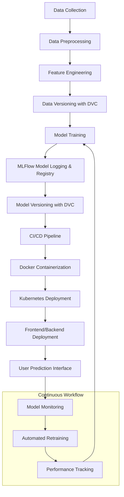

# MLOps Pipeline Project - Fall 2024

Welcome to the repository for the **MLOps Pipeline Project**! This project integrates advanced MLOps concepts such as **MLFlow**, **Airflow**, and **Kubernetes** to build a scalable and maintainable end-to-end machine learning application. Below, you will find the complete documentation of the project, its structure, and setup instructions.

---

## Table of Contents

1. [Project Overview](#project-overview)  
2. [Features](#features)  
3. [Tech Stack](#tech-stack)  
4. [Project Workflow](#project-workflow)  
5. [Installation Guide](#installation-guide)  
6. [Usage Guide](#usage-guide)  
7. [Branch Workflow](#branch-workflow)  
8. [Components Overview](#components-overview)  
   - [Data Versioning with DVC](#data-versioning-with-dvc)  
   - [Workflow Automation with Airflow](#workflow-automation-with-airflow)  
   - [Model Versioning with MLFlow](#model-versioning-with-mlflow)  
   - [Frontend Development](#frontend-development)  
   - [Backend Development](#backend-development)  
   - [Database Authentication](#database-authentication)  
   - [CI/CD Pipeline](#ci-cd-pipeline)  
   - [Kubernetes Deployment](#kubernetes-deployment)  
9. [Screenshots](#screenshots)  
10. [Resources](#resources)  
11. [License](#license)  

---

## Project Overview

This project demonstrates a robust MLOps pipeline from **data preprocessing** to **model deployment**. Key components include:  

- **Data Version Control (DVC):** Version control for datasets and model artifacts.  
- **MLFlow:** Model versioning, logging, and registry for deployment management.  
- **Airflow:** Workflow orchestration for automating data processing and model training pipelines.  
- **Docker & Kubernetes:** Scalable deployment using Docker images and Kubernetes clusters.  
- **Full-Stack Application:** A frontend and backend for real-time temperature predictions based on weather features.

---

## Features

- **Data versioning** using DVC for reproducibility.  
- Automated **workflow orchestration** with Airflow.  
- **Model versioning and tracking** with MLFlow.  
- **Frontend** interface for user interactions.  
- **Backend API** for model inference and database integration.  
- **CI/CD pipelines** for automated testing, building, and deployment.  
- Scalable deployment on **Minikube (Kubernetes)**.  

---

## Tech Stack

| Tool/Framework   | Purpose                                         |
|-------------------|-------------------------------------------------|
| **DVC**           | Data and model version control.                |
| **MLFlow**        | Model tracking and registry.                   |
| **Airflow**       | Workflow orchestration.                        |
| **Flask**         | Backend API for predictions.                   |
| **React**         | Frontend development.                          |
| **Docker**        | Containerization for applications.             |
| **Kubernetes**    | Deployment and scaling using Minikube.         |
| **GitHub Actions**| CI/CD pipelines for testing and deployment.    |
| **SQLite**        | Database for user authentication.              |

---

## Project Workflow


---

## Installation Guide

### Prerequisites

- **Python 3.9+**
- **Node.js and npm** (for frontend)
- **Docker**
- **Kubernetes (Minikube)**
- **Git**

### Clone the Repository

```bash
git clone https://github.com/S-Zaib/WeatherPredictonModel.git
cd WeatherPredictonModel
```

### Setup Virtual Environment

```bash
python -m venv env
source env/bin/activate  # On Windows: .\env\Scripts\activate
pip install -r requirements.txt
```

### Initialize Data & Model

```bash
python collect_data.py
python preprocess_data.py
python train_model.py
```

### Initialize DVC

```bash
dvc init
dvc remote add -d myremote gdrive://<your_gdrive_folder_id>
dvc remote modify myremote gdrive_use_service_account true
dvc remote modify myremote gdrive_acknowledge_abuse true
dvc remote modify myremote — local gdrive_service_account_json_file_path path/to/file.json
dvc add data/raw/raw.csv
dvc add data/processed/processed_data.csv
dvc add model/temperature_model.pkl
dvc push
```


### Setup Airflow

```bash
export AIRFLOW_HOME=./airflow
airflow db init
airflow users create --username admin --password admin --firstname Admin --lastname User --role Admin --email admin@example.com
airflow webserver --port 8080
```

### Setup MLFlow

```bash
mlflow ui
```

---

## Usage Guide

### Data Preprocessing

Ensure your dataset is stored and versioned with DVC:

```bash
dvc add data/raw/raw.csv
dvc add data/processed/processed_data.csv
dvc add model/temperature_model.pkl
dvc push
```

### Run Airflow Pipelines

Start Airflow and trigger the pipelines:

```bash
airflow scheduler
```

### Train Model

Execute model training and log metrics to MLFlow:

```bash
python train_model.py
```

### Frontend and Backend

Run the backend API:

```bash
python app.py
```

Run the frontend:

```bash
cd frontend
npm install
npm start
```

### Deploy with Kubernetes

```bash
minikube start
kubectl apply -f kubernetes/deployment.yaml
minikube service weather-prediction-service --url
```

---

## Branch Workflow

| Branch | Purpose                | Actions Triggered             |
|--------|------------------------|-------------------------------|
| **Dev** | Active development.    | None                          |
| **Test**| Automated testing.     | Unit tests, Docker build.     |
| **Prod**| Production deployment. | Kubernetes deployment.        |

---

## Components Overview

### Data Versioning with DVC

Tracks changes in data files and ensures reproducibility.

### Workflow Automation with Airflow

Automates tasks like data preprocessing and model retraining.

### Model Versioning with MLFlow

Logs metrics, hyperparameters, and model artifacts for easy tracking.

### Frontend Development

Developed with React for a responsive user interface.

### Backend Development

REST API using Flask/FastAPI to serve predictions and manage requests.

### Database Authentication

User signup and login with password hashing.

### CI/CD Pipeline

- **CI:** Runs unit tests and builds Docker images on GitHub Actions.
- **CD:** Deploys application to Kubernetes on merging to `prod`.

### Kubernetes Deployment

Deploys services using Minikube for a scalable infrastructure.

---

## Screenshots

*(Add relevant screenshots here: e.g., MLFlow UI, Airflow DAGs, application frontend, etc.)*

---

## Resources

- [MLFlow Documentation](https://mlflow.org/docs/latest/index.html)
- [Airflow Documentation](https://airflow.apache.org/docs/)
- [Kubernetes Documentation](https://kubernetes.io/docs/)

---

## License

This project is licensed under the MIT License.
